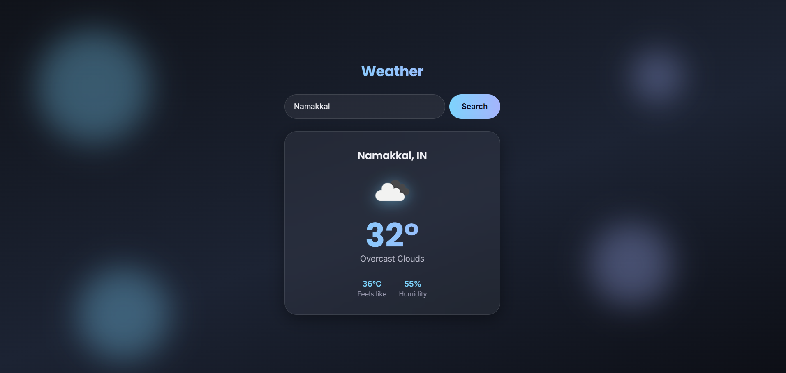

# 🌦️ Weather App — MERN Stack

A full-stack weather application with a dark, dynamic UI that shifts its color palette based on live weather conditions. Built with MongoDB, Express, React, and Node.js.

**Live demo:** https://weather-application-three-rose.vercel.app/
**Backend API:** https://weather-application-kgne.onrender.com



## Features

- 🔍 Real-time weather lookup by city name via the OpenWeatherMap API
- 🎨 Dynamic dark-themed UI — background gradient and accent colors change based on actual weather conditions (clear, rain, storms, snow, mist)
- 🔐 API key kept secure server-side (never exposed to the browser)
- ⚡ Fast dev experience with Vite
- 📱 Responsive, mobile-friendly layout

## Tech Stack

**Frontend:** React (Vite), Axios, custom CSS with CSS variables for theming — deployed on Vercel
**Backend:** Node.js, Express, Axios — deployed on Render
**Database:** MongoDB (Atlas) — *for user accounts & saved cities, in progress*

## Architecture

```
React (client) → Express API (server) → OpenWeatherMap API
                        ↓
                    MongoDB Atlas
```

The frontend never calls the weather API directly — it goes through the Express backend, which keeps the API key secret and can layer in caching, auth, and saved-city logic.

## Getting Started

### Prerequisites
- Node.js installed
- A free [OpenWeatherMap API key](https://openweathermap.org/api)

### Installation

```bash
git clone https://github.com/your-username/weather-app.git
cd weather-app
```

**Backend:**
```bash
cd server
npm install
cp .env.example .env   # add your OpenWeatherMap API key here
npm run dev
```

**Frontend** (new terminal):
```bash
cd client
npm install
npm run dev
```

Visit the local URL Vite prints and search any city.

### Environment Variables

**server/.env**
```
OPENWEATHER_API_KEY=your_api_key_here
PORT=5000
MONGO_URI=your_mongodb_connection_string
```

**client/.env**
```
VITE_API_URL=http://localhost:5000
```

## Project Structure

```
weather-app/
├── server/
│   ├── routes/          # Express route handlers
│   ├── server.js        # App entry point
│   └── .env.example
├── client/
│   ├── src/
│   │   ├── components/  # SearchBar, WeatherCard
│   │   ├── App.jsx
│   │   └── index.css
└── README.md
```

## Deployment

- **Frontend:** Vercel (auto-deploys from `client/` on push to `main`)
- **Backend:** Render (auto-deploys from `server/` on push to `main`)
- **Database:** MongoDB Atlas (free M0 cluster)

> Note: the backend is on Render's free tier, which sleeps after inactivity. The first request after idle time may take 30–50 seconds to respond.

## Roadmap

- [x] Current weather lookup
- [x] Dynamic weather-based theming
- [x] Deployed live (Vercel + Render)
- [ ] 5-day forecast view
- [ ] User auth (JWT) + saved favorite cities (MongoDB)
- [ ] °C / °F toggle
- [ ] Geolocation-based auto-detect

## What I Learned

Building this project helped me understand how to structure a full-stack app end to end — protecting API keys on the server side instead of exposing them in a React app, designing a REST API with Express, and deploying a decoupled frontend/backend to separate hosting platforms.

## License

MIT
